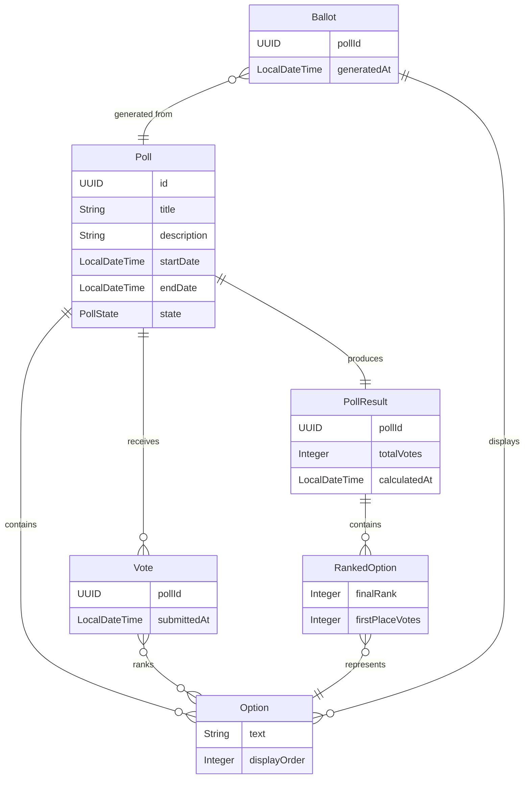

# Business Data Model - Rankify API

This document describes the business data model for the Rankify API, an application for ranked voting. The model follows Domain-Driven Design (DDD) principles, clearly distinguishing between entities and value objects.

## Domain Overview

The Rankify API enables the creation and management of ranked voting polls. Users can create polls with multiple options, and participants can cast votes by ranking their preferences. The system manages the entire lifecycle from poll creation through result calculation.

## Core Business Concepts

### Entities vs Value Objects

**Entities** have a unique identity (ID) and their attributes can change over time. It's important to be able to find them by their ID.

**Value Objects** are immutable objects without identity. Two value objects are considered equal when all their attributes are equal. They are essentially "throw-away" objects that don't need an ID.

## Business Objects

### Poll (Entity)

The `Poll` is the central entity in our domain. It represents a voting session with a specific set of options.

**Attributes:**
- `id` (UUID) - Unique identifier
- `title` (String) - Human-readable name for the poll
- `description` (String) - Optional detailed description
- `options` (Set<Option>) - The set of unique options to be ranked
- `startDate` (LocalDateTime) - When voting begins
- `endDate` (LocalDateTime) - When voting ends
- `state` (PollState) - Current state of the poll

**Lifecycle States:**
- `IN_PREPARATION` - Poll is being set up, not yet active
- `ONGOING` - Poll is active and accepting votes
- `FINISHED` - Poll has ended, results can be calculated

**Business Rules:**
- A poll must have at least 2 options
- Options must be unique within a poll
- Start date must be before end date
- State transitions: IN_PREPARATION → ONGOING → FINISHED
- Once FINISHED, no further votes can be accepted

**Why Entity?**
Poll is an entity because it has a unique identity that persists throughout its lifecycle, and its state changes over time (preparation → ongoing → finished).

### Option (Value Object)

Represents a choice that can be ranked in a poll.

**Attributes:**
- `text` (String) - The option text/description
- `displayOrder` (Integer) - Optional order for display purposes

**Business Rules:**
- Text cannot be empty or null
- Two options with the same text are considered equal
- Display order is used only for presentation, not for voting logic

**Why Value Object?**
Option is a value object because it represents a simple value without identity. Two options with the same text are considered identical regardless of when or where they were created.

### Ballot (Value Object)

Represents the voting form presented to a participant, containing all options for a specific poll.

**Attributes:**
- `pollId` (UUID) - Reference to the poll
- `options` (List<Option>) - Ordered list of options as they appear on the ballot
- `generatedAt` (LocalDateTime) - When the ballot was generated

**Business Rules:**
- Can only be generated for polls in ONGOING state
- Contains all options from the associated poll
- Options order may be randomized to avoid bias

**Why Value Object?**
Ballot is a value object because it's a temporary, immutable representation of voting options at a specific point in time. Once generated, it doesn't change.

### Vote (Value Object)

Represents a participant's ranking of options in a poll.

**Attributes:**
- `pollId` (UUID) - Reference to the poll being voted on
- `rankings` (Map<Option, Integer>) - Option to rank mapping (1 = highest preference)
- `submittedAt` (LocalDateTime) - When the vote was cast

**Business Rules:**
- Can only be cast for polls in ONGOING state
- Rankings start at 1 (highest preference)
- Multiple options can have the same rank (ties allowed)
- Unranked options are considered to have the lowest rank
- At least one option must be ranked

**Why Value Object?**
Vote is a value object because once cast, it's immutable. Anonymous voting is supported, so votes do not contain voter identification.

### PollResult (Value Object)

Represents the calculated results of a completed poll.

**Attributes:**
- `pollId` (UUID) - Reference to the poll
- `finalRanking` (List<RankedOption>) - Final ranking of all options
- `totalVotes` (Integer) - Total number of votes cast
- `calculatedAt` (LocalDateTime) - When results were calculated

**Business Rules:**
- Can only be calculated for polls in FINISHED state
- Results are immutable once calculated
- Ties in final ranking are allowed
- Must include all options from the original poll

**Why Value Object?**
PollResult is a value object because it represents a snapshot of calculated results at a specific time. It's derived data that doesn't change once computed.

### RankedOption (Value Object)

Represents an option with its final ranking position in poll results.

**Attributes:**
- `option` (Option) - The option being ranked
- `finalRank` (Integer) - Final position in results (1 = winner)
- `firstPlaceVotes` (Integer) - Count of votes that ranked this option first

**Business Rules:**
- Final rank must be a positive integer
- Multiple options can have the same final rank (ties allowed)
- First place votes count cannot exceed total votes in the poll

**Why Value Object?**
RankedOption is a value object because it represents the immutable result of an option's performance in a completed poll.

## Entity Relationship Diagram

## Domain Rules and Constraints

### Cross-Object Rules

1. **Vote Validation**: A vote can only reference options that exist in the associated poll
2. **Ballot Generation**: Ballots can only be generated for polls in ONGOING state
3. **Result Calculation**: Results can only be calculated for polls in FINISHED state
4. **State Transitions**: Poll state must follow the defined lifecycle
5. **Temporal Constraints**: Current time must be between startDate and endDate for ONGOING polls

### Reference Rules

- **Entities may reference value objects**: Poll contains Options
- **Value objects may NOT reference entities**: All references from value objects to Poll use pollId (UUID) rather than Poll entity reference
- **Value objects may reference other value objects**: Vote references Options, PollResult contains RankedOptions

## Business Scenarios

### Creating a Poll
1. Create Poll entity with IN_PREPARATION state
2. Add Options (value objects) to the poll
3. Set start and end dates
4. Transition to ONGOING state when ready

### Voting Process
1. Generate Ballot (value object) from ONGOING poll
2. Participant creates Vote (value object) with their rankings
3. System validates vote against poll options
4. Vote is stored (immutable) - anonymous voting is supported

### Result Calculation
1. Poll transitions to FINISHED state
2. System retrieves all votes for the poll
3. Applies ranking algorithm to calculate results
4. Creates PollResult (value object) with final rankings
5. Results are immutable once calculated

## Implementation Notes

- **Entity Storage**: Poll requires persistent storage with identity management
- **Value Object Storage**: Can be stored as embedded objects or in separate tables without identity concerns
- **Immutability**: All value objects should be implemented as immutable classes
- **Validation**: Business rules should be enforced at the domain level, not just at the persistence layer
- **Aggregates**: Poll serves as an aggregate root, managing consistency of its contained Options

This model prioritizes business clarity over technical implementation details, following the principle that the domain should drive the technical design, not vice versa.