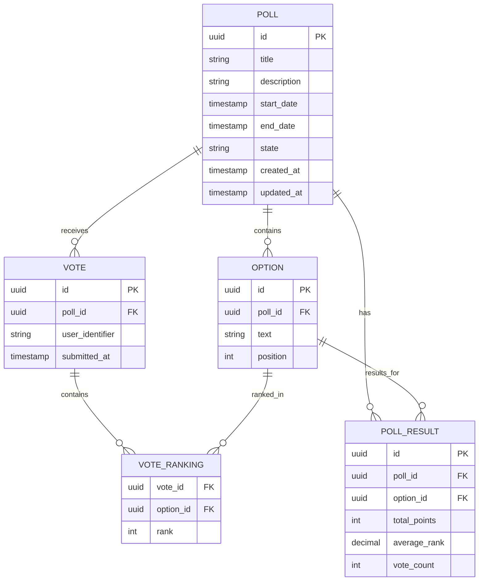

# Technical Data Model - Rankify API

This document describes how the business data model defined in [businessModel.md](businessModel.md) is mapped to a relational database schema. The design is database-agnostic and can be implemented using either JPA/Hibernate or Spring Data JDBC.

## Overview

The technical data model translates the domain-driven business model into a normalized relational database schema. The key principle is that **entities** get their own tables with primary keys, while **value objects** are either embedded within entity tables or stored in separate tables without independent identity.

## Entity Relationship Design

### Core Entities and Value Objects

Based on the business model, we have one main entity and several value objects:

- **Poll** (Entity) - Has independent identity and lifecycle
- **Option** (Value Object) - Belongs to a Poll
- **Vote** (Value Object) - Represents a complete ranking by a user
- **PollResult** (Value Object) - Aggregated results for a Poll

### Database Schema Overview

## Table Descriptions

### Poll Table
The main entity table storing poll information:
- **Primary Key**: UUID for security and distributed system compatibility
- **State Management**: Tracks poll lifecycle (IN_PREPARATION, ONGOING, FINISHED)
- **Time Boundaries**: Start and end dates define when voting is allowed
- **Audit Fields**: Created and updated timestamps for tracking

### Option Table
Stores the choices available in each poll:
- **Relationship**: Many options belong to one poll
- **Business Rule**: Option text must be unique within a poll
- **Ordering**: Position field allows for consistent display order

### Vote Table
Represents a complete ranking submission by a user:
- **User Tracking**: User identifier (could be session ID, user ID, or anonymous token)
- **Integrity**: One vote per user per poll (enforced by unique constraint)
- **Timestamp**: When the vote was submitted

### Vote Ranking Table
Junction table storing the actual rankings:
- **Composite Key**: Vote ID + Option ID uniquely identifies each ranking
- **Rank Value**: Integer representing the preference order (1 = most preferred)
- **Completeness**: Each vote must rank all available options (business rule)

### Poll Result Table
Materialized view of calculated results:
- **Aggregation**: Pre-calculated totals for performance
- **Metrics**: Total points, average rank, vote count per option
- **Refresh Strategy**: Updated when poll state changes to FINISHED

## Data Integrity Rules

### Referential Integrity
- All foreign key relationships enforce cascade delete
- Options cannot exist without their parent poll
- Votes cannot exist without their parent poll
- Vote rankings cannot exist without both vote and option

### Business Rules
- Poll end date must be after start date
- Option text must be unique within each poll
- Each vote must rank all available options exactly once
- Rank values must be consecutive integers starting from 1
- Only one vote per user per poll

### State Transitions
- Polls start in IN_PREPARATION state
- Only ONGOING polls accept new votes
- FINISHED polls are read-only and trigger result calculation

## Implementation Considerations

### Technology Agnostic Design
This schema can be implemented using:
- **JPA/Hibernate**: Entity classes with annotations
- **Spring Data JDBC**: Simple POJOs with repository interfaces
- **Raw SQL**: Direct database interaction with any SQL database

### Performance Optimization
- Index on poll state for filtering active polls
- Index on poll dates for time-based queries
- Index on user identifier for vote lookup
- Consider partitioning large vote tables by poll or date

### Scalability Considerations
- UUIDs enable horizontal partitioning
- Vote rankings can be sharded by poll
- Poll results can be cached or materialized
- Read replicas for result queries during active polls

This technical data model provides a robust foundation for implementing the business model in a relational database while maintaining data integrity, performance, and scalability.